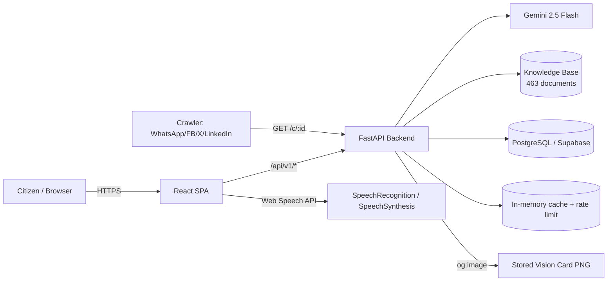
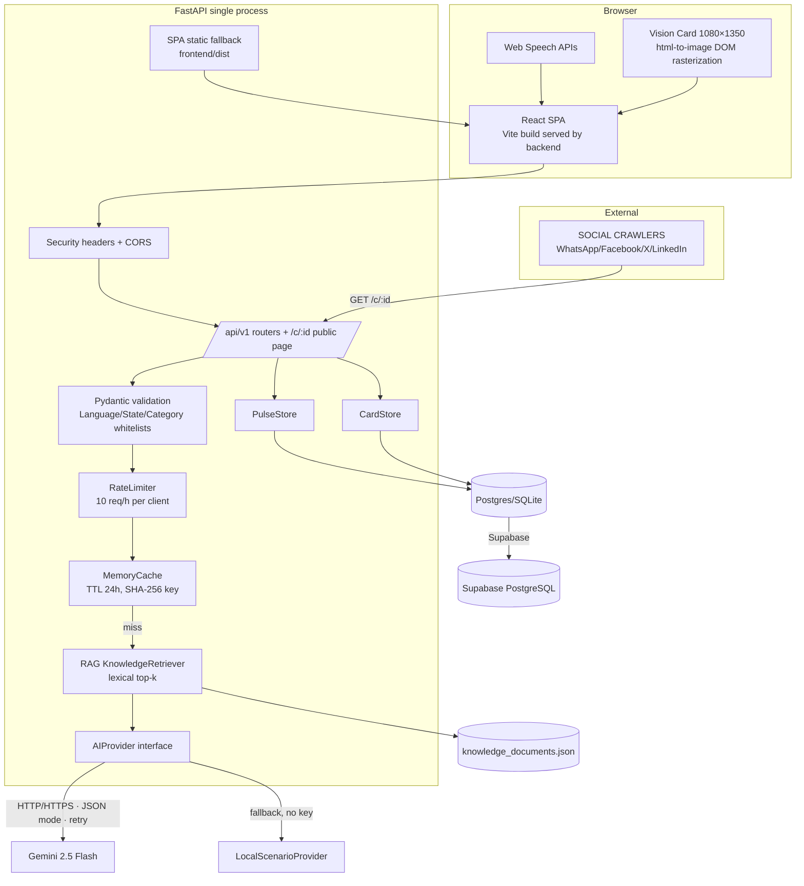
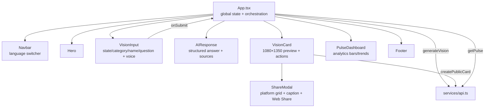
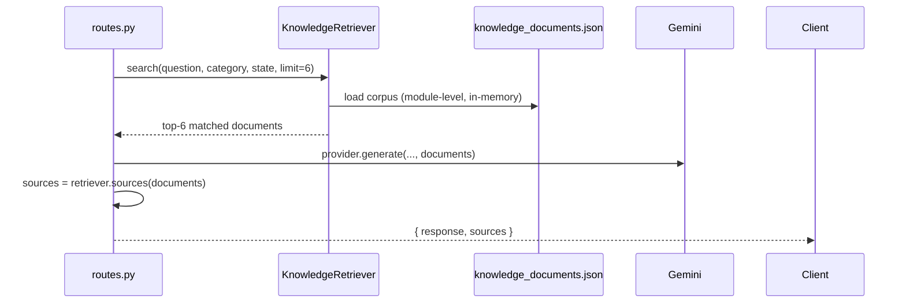
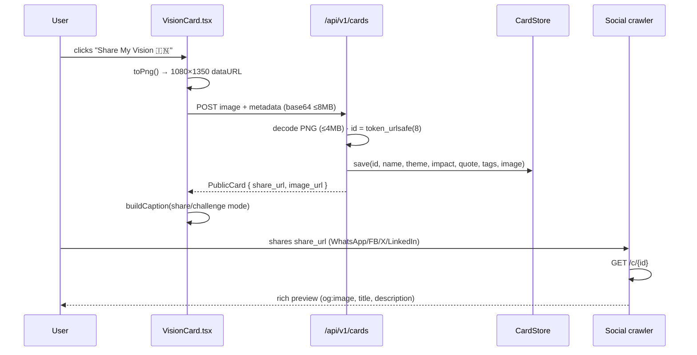
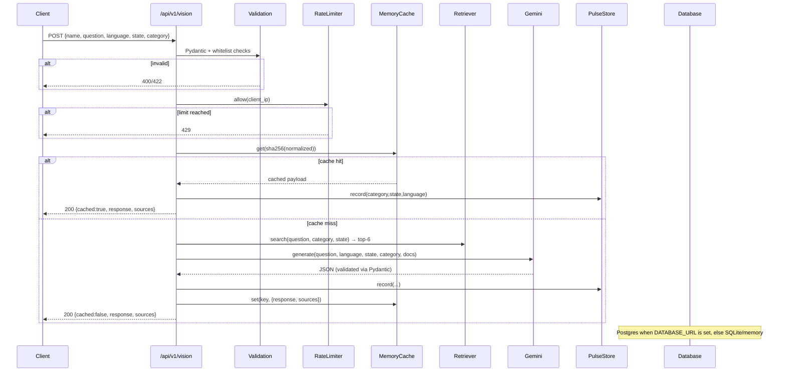
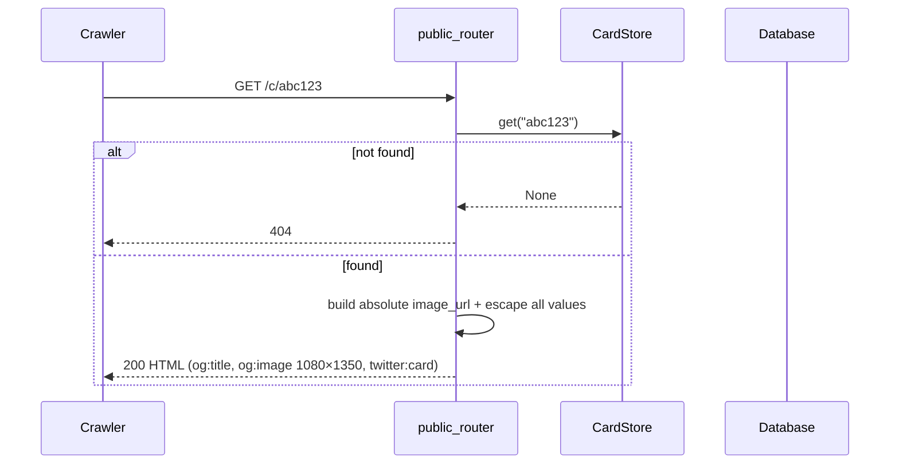
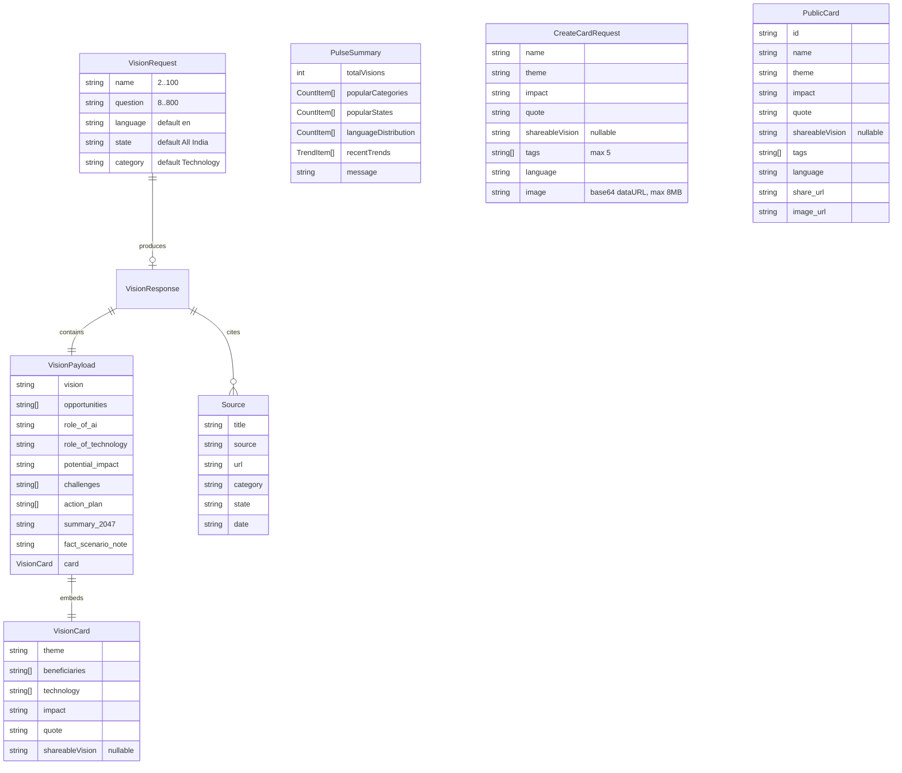
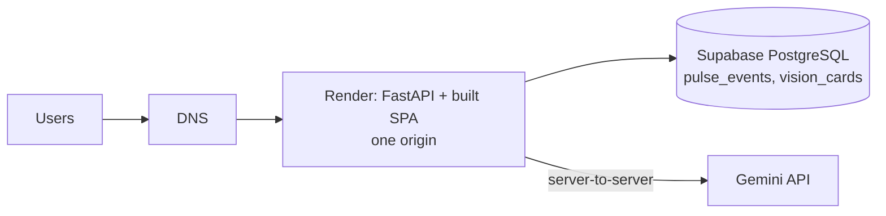

# Viksit Bharat 2047 AI — Technical Architecture

> Written from the perspective of the AI Engineer who designed and built the system.
> Version: 0.1.0 · Last updated: 2026

---

## Table of Contents

1. [Executive Summary](#1-executive-summary)
2. [System Context](#2-system-context)
3. [Technology Stack](#3-technology-stack)
4. [Repository Layout](#4-repository-layout)
5. [High-Level Architecture](#5-high-level-architecture)
6. [Frontend Architecture](#6-frontend-architecture)
7. [Backend Architecture](#7-backend-architecture)
8. [AI / LLM Integration Layer](#8-ai--llm-integration-layer)
9. [RAG Pipeline](#9-rag-pipeline)
10. [Data Layer & Persistence](#10-data-layer--persistence)
11. [Sharing & Social Preview Subsystem](#11-sharing--social-preview-subsystem)
12. [Request Lifecycle (Sequence Diagrams)](#12-request-lifecycle-sequence-diagrams)
13. [Data Model](#13-data-model)
14. [API Reference](#14-api-reference)
15. [Configuration & Environment Variables](#15-configuration--environment-variables)
16. [Security](#16-security)
17. [Performance, Reliability & Cost Control](#17-performance-reliability--cost-control)
18. [Testing Strategy](#18-testing-strategy)
19. [Deployment Architecture](#19-deployment-architecture)
20. [Known Limitations](#20-known-limitations)
21. [Scalability Roadmap](#21-scalability-roadmap)
22. [Key Design Decisions & Trade-offs](#22-key-design-decisions--trade-offs)

---

## 1. Executive Summary

**Viksit Bharat 2047 AI** is an independent, non-government AI product that lets citizens articulate a personal vision for India in 2047, receives a **structured, source-grounded AI scenario** in one of **11 Indian languages**, and generates a **shareable 1080×1350 "My Viksit Bharat Vision" card** with a unique public URL, Open Graph metadata and multi-platform sharing.

The system is a **two-tier monolith** (single deployable unit):

- A **React + TypeScript + Vite** SPA that is *compiled at build time* and **served by the backend itself** (FastAPI static/SPA fallback) — so the entire product runs on **one origin**.
- A **FastAPI** service that owns all business logic, LLM calls, retrieval, caching, rate limiting and persistence.

The AI layer is deliberately small and explicit: **Retrieve → Prompt → Structured JSON out → Validate → Render → Persist**. The prompt is contract-driven (Pydantic-validated), the retriever is deterministic, and the LLM provider is abstracted behind an interface with a **zero-cost local fallback** for development and CI.

Production persistence targets **Supabase (PostgreSQL)**; the services are written with a **triple-backend abstraction** (Postgres / SQLite / in-memory) so the same code runs on a laptop, in CI, or in the cloud with a single `DATABASE_URL` change.

---

## 2. System Context



External dependencies:

| Dependency | Role | Invocation |
|---|---|---|
| Google Gemini API (`generativelanguage.googleapis.com`) | LLM generation | Backend only, server-to-server |
| Supabase (PostgreSQL) | Pulse analytics + card persistence | Optional; SQLite fallback locally |
| Browser Web Speech API | Voice input (recognition) + voice output (synthesis) | Client only, no external cost |

There is **no client-side LLM call** and **no API key in the frontend bundle**.

---

## 3. Technology Stack

### Backend (`backend/`)
| Layer | Choice | Version |
|---|---|---|
| Runtime | Python | 3.11+ |
| Web framework | FastAPI | 0.115.6 |
| ASGI server | uvicorn | 0.34.0 |
| Validation / config | Pydantic, pydantic-settings | 2.10.4 / 2.7.1 |
| HTTP client | httpx (async) | 0.28.1 |
| RDBMS drivers | sqlite3 (stdlib), psycopg | 3.2.x |
| PDF parsing | pypdf | 5.1.0 |
| Testing | pytest + TestClient | 8.3.4 |

### Frontend (`frontend/`)
| Layer | Choice | Version |
|---|---|---|
| Framework | React | 18.3.1 |
| Language | TypeScript | 5.7.2 |
| Build tool | Vite | 6.0.7 |
| Card rasterization | html-to-image | 1.11.11 |
| Icons | lucide-react | 0.468.0 |
| Linting | ESLint 9 + typescript-eslint | 8.18.2 |

---

## 4. Repository Layout

```text
India_2047_Vikshit_Bharat_Vision/
├── backend/
│   ├── app/
│   │   ├── ai/
│   │   │   └── provider.py          # AIProvider abstraction, Gemini + local fallback, SYSTEM_PROMPT
│   │   ├── api/
│   │   │   └── routes.py            # /api/v1/* API router + public_router (/c/:id OG page)
│   │   ├── core/
│   │   │   ├── config.py            # Pydantic Settings (env-driven)
│   │   │   └── constants.py         # LANGUAGES (11), STATES (35), CATEGORIES (17)
│   │   ├── data/
│   │   │   └── knowledge_documents.json   # Generated RAG corpus (463 docs)
│   │   ├── rag/
│   │   │   └── retriever.py         # KnowledgeRetriever: lexical scoring retrieval
│   │   ├── services/
│   │   │   ├── cache.py             # TTL in-memory cache
│   │   │   ├── cards.py             # CardStore: vision_cards persistence (3 backends)
│   │   │   ├── pulse.py             # PulseStore: pulse_events aggregation (3 backends)
│   │   │   └── rate_limit.py        # Sliding-window per-client limiter
│   │   ├── utils/
│   │   │   └── hash.py              # Normalization + SHA-256 cache keys
│   │   ├── main.py                  # App factory, CORS, security headers, SPA fallback
│   │   └── schemas.py               # All Pydantic request/response contracts
│   ├── data/                        # Local SQLite file (gitignored)
│   ├── scripts/
│   │   └── ingest_rag_data.py       # PDF/CSV → knowledge_documents.json pipeline
│   ├── tests/                       # test_api.py (12), test_core.py (unit)
│   ├── .env / .env.example
│   └── requirements.txt
├── frontend/
│   ├── src/
│   │   ├── components/              # VisionInput, AIResponse, VisionCard, ShareModal,
│   │   │                            #   PulseDashboard, Navbar, Hero, Footer
│   │   ├── hooks/useSpeech.ts       # SpeechRecognition + speechSynthesis wrapper
│   │   ├── locales/*.json           # 11 UI language dictionaries
│   │   ├── services/api.ts          # Typed fetch client
│   │   ├── types/api.ts             # Shared API types
│   │   ├── utils/i18n.ts            # Dictionary resolution + persistence
│   │   ├── App.tsx                  # State orchestration
│   │   └── main.tsx
│   ├── dist/                        # Build output (served by backend)
│   ├── index.html, vite.config.ts, tsconfig.json, eslint.config.js
│   └── package.json
├── RAG_Data/                        # Raw source documents (PDFs, OWID & World Bank CSVs)
├── ARCHITECTURE.md
└── README.md
```

---

## 5. High-Level Architecture

The system follows a **layered + hexagonal (ports & adapters)** shape: core business flows depend on interfaces (`AIProvider`, store abstractions), and concrete adapters are selected by configuration.



---

## 6. Frontend Architecture

### 6.1 Component tree & responsibilities



### 6.2 State management

State is **local component state** in `App.tsx` — deliberately no Redux/Zustand; the tree is small and the data flow is one-directional.

| State | Type | Purpose |
|---|---|---|
| `language` | `LanguageCode` | Selected UI language; persisted in `localStorage` |
| `state` / `category` | `string` | Input context; sent to backend for RAG + prompt |
| `name` | `string` | Citizen identity; required (≥2 chars) for card personalization |
| `question` | `string` | The citizen's vision statement |
| `result` | `VisionResponse \| null` | Full AI response + sources |
| `pulse` | `PulseSummary \| null` | Aggregated analytics from `/api/v1/pulse` |
| `loading` / `error` | `boolean` / `string` | Async state + user-facing errors |

### 6.3 i18n architecture (`utils/i18n.ts`)

- 11 JSON dictionaries under `locales/`; `Dictionary = typeof en` — **TypeScript enforces key parity across all languages at compile time**.
- `LanguageCode = keyof typeof dictionaries`; unknown/absent values fall back to English.
- Language choice persists to `localStorage` (`getSavedLanguage`).
- The language **code** is sent to the backend so Gemini writes its narrative in the same language as the UI.

### 6.4 Voice layer (`hooks/useSpeech.ts`)

- **Recognition**: `window.SpeechRecognition ?? window.webkitSpeechRecognition` with `lang = en-IN / hi-IN / …` mapped per language. Errors mapped to a closed set (`unsupported | permission | network | noSpeech | failed`) and surfaced via localized strings.
- **Synthesis**: `speechSynthesis.speak()` reads the `summary_2047` back; cancels any prior utterance. No external voice API — zero cost.

### 6.5 Vision Card rendering

- A CSS-styled DOM node is rendered at fixed **1080×1350** design dimensions inside a responsive scale frame (`ResizeObserver` computes `scale = frameWidth / 1080`).
- Theme resolution (`resolveTheme`) regex-matches card text → one of 11 visual themes (accent color, emoji, tag chips, glow).
- Quote typography is **adaptive** (`quoteFontSize`, `personaFontSize`) so long names/quotes never overflow the canvas.
- The India outline is an inline SVG path — no external image asset.
- Rasterization uses `html-to-image` `toPng(pixelRatio: 1, width/height 1080×1350)` for **download** and for the **share upload** (see §11).

---

## 7. Backend Architecture

### 7.1 Application entry (`main.py`)

- `FastAPI()` app with title/version metadata.
- **CORS**: allowlist built from `FRONTEND_ORIGIN`, `http://localhost:5173`, and `PUBLIC_BASE_URL` — only configured origins are allowed.
- **Security headers** via an `@app.middleware("http")`:
  - `X-Content-Type-Options: nosniff`
  - `X-Frame-Options: DENY`
  - `Referrer-Policy: strict-origin-when-cross-origin`
  - `Permissions-Policy: camera=(), geolocation=(), payment=()`
- **Routers**: `router` (`/api/v1/*`) + `public_router` (`/c/:id`).
- **SPA fallback**: a catch-all `GET /{full_path:path}` serves `frontend/dist` with safe path traversal guards (`file.relative_to(DIST_DIR)`). Routes under `api/` and `c/` are excluded (→ 404) so API 404s are never masked by the SPA. Returns 503 with a hint if the build is missing.

### 7.2 Configuration (`core/config.py`)

`pydantic-settings` `BaseSettings`; all values overridable by env / `.env` (see §15). Cached via `@lru_cache`.

### 7.3 Validation & constants

`schemas.py` defines the full contract surface; `constants.py` is the **single source of truth** for the 11 languages, 35 states, 17 categories — used for server-side whitelist validation (the client duplicates these lists for the dropdowns).

---

## 8. AI / LLM Integration Layer

File: `backend/app/ai/provider.py`

### 8.1 Provider abstraction (Port)

```python
class AIProvider(ABC):
    async def generate(question, language, state, category, documents) -> VisionPayload
```

Two adapters implement the port:

1. **`GeminiProvider`** — production (active when `GEMINI_API_KEY` is set).
2. **`LocalScenarioProvider`** — deterministic, zero-cost fallback for dev/CI (no API key).

`build_provider(api_key, model)` selects the adapter at request time.

### 8.2 Prompt engineering (contract-driven JSON)

`SYSTEM_PROMPT` encodes an **optimistic-but-realistic analyst persona** with 9 rules:
1–3. No fabricated facts/statistics; label scenarios vs. facts explicitly.
4. Neutral on politics/partisanship.
5. Respects India's linguistic/cultural diversity.
6. Explains complex concepts simply.
7. Prioritizes practical solutions and trade-offs.
8. **Prefers retrieved sources for factual claims** (ties the LLM to the RAG layer).
9. **Never fabricates citations** (prevents hallucinated references).

The prompt payload injected at request time:

```json
{
  "system": "<SYSTEM_PROMPT>",
  "language": "en",
  "state": "All India",
  "category": "Education",
  "question": "<user vision>",
  "retrieved_documents": [ "<up to 6 RAG documents>" ],
  "instruction": "Return only valid JSON matching the requested schema. Do not include markdown."
}
```

Output contract is **exact**: `VisionPayload` with 10 top-level fields plus a nested `card` object — enforced twice (generation config `responseMimeType: application/json` + Pydantic `model_validate_json`).

### 8.3 Gemini call parameters

| Parameter | Value | Rationale |
|---|---|---|
| Endpoint | `generativelanguage.googleapis.com/v1beta/models/{model}:generateContent` | Official REST API; server-side `key` |
| Model | `gemini-2.5-flash` (configurable) | Latency/cost balance for a citizen tool |
| `temperature` | `0.45` | Creative but grounded |
| `responseMimeType` | `application/json` | Structured output mode |
| Timeout | `35s` (httpx `AsyncClient`) | Bounded latency for UX |
| Transport | `httpx.AsyncClient` per attempt | Non-blocking in async endpoint |

### 8.4 Resilience (added after a production incident)

Transient Google "upstream unavailable / endpoint unavailable" failures are handled with a **3-attempt retry loop** with linear backoff (`1.5s`, `3s`) on retryable statuses `{429, 500, 502, 503, 504}` and on transport/connect errors. Non-retryable failures (e.g., 400/401) surface immediately. Final failure raises the last exception, mapped in `routes.py` to HTTP 502 with a user-safe message (detailed exception type only in `development`).

### 8.5 Error mapping

| Condition | HTTP | Client message |
|---|---|---|
| Upstream LLM failure (after retries) | 502 | "India AI is taking a little longer…" (generic in prod) |
| Rate limit exceeded | 429 | "You've reached the free usage limit…" |
| Unsupported language/state/category | 400 | "Unsupported …" |
| Invalid payload (Pydantic) | 422 | Framework default |

---

## 9. RAG Pipeline

### 9.1 Corpus construction (offline, `scripts/ingest_rag_data.py`)

Raw sources in `RAG_Data/` are transformed into `backend/app/data/knowledge_documents.json` (**463 documents**) through three ingestors:

| Source | Processor | Output shape |
|---|---|---|
| Government PDF reports (NITI, MoSPI, NDHM, PLFS…) | `pypdf` text extraction → cleaning → **sliding-window chunking** (1800 chars, 120 overlap, max 25 chunks/PDF) | One document per chunk, titled `(Part N)`; category inferred by keyword heuristics; source derived from filename markers/PDF metadata |
| Our World in Data (OWID) folder CSVs + metadata.json | Row-parsing for India, latest value + range + trend summarization | One synthesized document per indicator |
| OWID energy dataset (`owid-energy-data.csv`) | India snapshot + 5-year trend rows | One document |
| World Bank WDI (`API_IND_DS2_en_csv_v2_1896.csv`) | Headline-indicator filter → latest non-zero value ≥2010 per code | One document per indicator |

The pipeline is **idempotent and append-only**: it loads existing documents, dedupes by title, sorts by (category, title), and rewrites the JSON. The `archive/` folder is skipped. Re-ingestion:

```bash
python scripts/ingest_rag_data.py
```

### 9.2 Document schema

```json
{
  "title": "…",       "source": "…",
  "url": "",          "category": "Education",
  "state": "All India","date": "2026",
  "content": "…"
}
```

### 9.3 Retrieval algorithm (`rag/retriever.py`) — deterministic, explainable

For the MVP the retriever is **lexical scoring over metadata + content** (no embeddings — see §22 trade-offs):

1. **Tokenize** the query into a set of tokens (length > 2, stripped of punctuation, lowercased).
2. For each document compute a **score**:
   - `+10` × number of overlapping tokens with `title + source + content`
   - `+5`  if document `category` matches the requested category
   - `+2`  if document `state` matches the requested state or is `All India`
3. Keep only `score > 0`, **sort desc**, dedupe to **≤ 2 chunks per base title** (`(Part N)` stripped), and return **top 6** documents.

Why it's safe: retrieval is fully deterministic, unit-tested, and the LLM is explicitly told never to claim a source was consulted unless it was actually retrieved. Sources displayed in the UI (`retriever.sources(documents)`) come **only** from the retrieved subset.

### 9.4 Prompt-to-corpus flow



---

## 10. Data Layer & Persistence

### 10.1 Triple-backend store pattern

Both `PulseStore` and `CardStore` implement the same adapter pattern driven by `DATABASE_URL`:

| URL prefix | Adapter | Use case |
|---|---|---|
| `sqlite:///:memory:` | in-memory SQLite | Tests (`conftest.py` forces this) |
| `sqlite:///path` | file SQLite | Local dev (default `data/pulse.db`) |
| `postgres(ql)://…` | psycopg 3 | Production (Supabase) |

This keeps **tests hermetic, local dev dependency-free, and production persistent** — one code path, three backends.

### 10.2 `PulseStore` (`services/pulse.py`)

- Table `pulse_events(id, category, state, language)` — append-only event log.
- `record()` inserts; `summary()` aggregates on read:
  - `totalVisions`
  - `popularCategories` / `popularStates` / `languageDistribution` (top-5 via `Counter`)
  - `recentTrends` (last 6 events, reversed)
- Empty-state message is returned (no fabricated statistics).
- SQLite connection uses `check_same_thread=False` + a `threading.Lock` for safety under the async server threadpool.

### 10.3 `CardStore` (`services/cards.py`)

- Table `vision_cards(id TEXT PK, name, theme, impact, quote, shareable_vision, tags JSON, language, image BYTEA/BLOB, created_at)`.
- Stores the **rasterized 1080×1350 PNG bytes** in the database (Postgres `BYTEA`, SQLite `BLOB`) — keeps the public card URL + image on a single origin.
- `tags` serialized as JSON string on write, `json.loads` on read.
- `get()` returns a normalized dict across all backends.

### 10.4 Cache (`services/cache.py`)

- `MemoryCache(ttl_seconds=86400)` — process-local, TTL-expiring `{key: (expires_at, value)}`.
- Keys are `SHA-256` of the **normalized** `question|language|state|category` (`utils/hash.py`) so whitespace/case variants share a cache entry.
- Cached hits still `record()` a pulse event (so analytics count real usage) but skip the LLM → **identical questions cost nothing and return instantly**.

### 10.5 Rate limiter (`services/rate_limit.py`)

- Sliding-window per client (keyed by `request.client.host`), default **10 requests/hour**.
- Implemented as `defaultdict[deque[float]]` with lazy pruning — O(1) amortized, no external store.

---

## 11. Sharing & Social Preview Subsystem

This is the viral loop of the product and deserves its own section.

### 11.1 Flow (frontend → backend → crawlers)



### 11.2 Backend endpoints

| Endpoint | Purpose |
|---|---|
| `POST /api/v1/cards` | Persist card; returns `PublicCard` |
| `GET /api/v1/cards/{id}` | JSON card metadata |
| `GET /api/v1/cards/{id}/image.png` | Rasterized card image (`image/png`) |
| `GET /c/{id}` | **Public OG HTML page** (no `/api` prefix — crawler friendly) |

Card IDs: `secrets.token_urlsafe(8)` → ~56 bits of entropy (unguessable, short URLs).

### 11.3 Canonical URL resolution (no localhost in production)

`_base_url(request)` returns `settings.public_base_url` (e.g. `https://app.example.com/`) **when configured**, else the request's `base_url`. The public page HTML, `og:image`, and `share_url` all derive from this, so in production every shared link is absolute and crawler-reachable. The frontend likewise prefers `VITE_PUBLIC_URL ?? VITE_APP_URL ?? window.location.origin`.

### 11.4 Open Graph / Twitter metadata

```html
<meta property="og:title" content="{name}'s Vision for India 2047">
<meta property="og:description" content="{quote[:160]}">
<meta property="og:image" content="{base}/api/v1/cards/{id}/image.png">
<meta property="og:image:width" content="1080">
<meta property="og:image:height" content="1350">
<meta name="twitter:card" content="summary_large_image">
```

The page is server-rendered HTML (inline CSS, no JS dependency) so **WhatsApp/Facebook/X/LinkedIn crawlers get a correct preview instantly**, and the human visitor sees the card + a "Create Your Own Vision" CTA. All interpolated values are HTML-escaped.

### 11.5 Frontend share surface (`ShareModal.tsx`)

| Target | Mechanism |
|---|---|
| WhatsApp | `https://wa.me/?text=` + caption + URL |
| Facebook | `sharer/sharer.php?u=` |
| LinkedIn | `sharing/share-offsite/?url=` |
| X/Twitter | `intent/tweet?text=&url=` |
| Instagram | **Download PNG + Copy Caption** (web can't attach images via link) |
| Copy link | `navigator.clipboard` with "Copied!" feedback |
| Web Share | `navigator.share()` **with the PNG attached** when `canShare({files})` is supported (mobile) |

Captions (editable in the modal):

- **Share**: `🇮🇳 This is my vision for India 2047. What is yours? … Create your vision at {url} #ViksitBharat2047 #India2047 #AIForIndia`
- **Challenge**: `I shared my vision for India 2047 🇮🇳 Now it's your turn. Create yours! {url} …`

---

## 12. Request Lifecycle (Sequence Diagrams)

### 12.1 `POST /api/v1/vision` (uncached path)



### 12.2 `GET /c/{card_id}` (crawler / public page)



---

## 13. Data Model

### 13.1 API contracts (`schemas.py`)



### 13.2 Persistent tables

| Table | Columns | Notes |
|---|---|---|
| `pulse_events` | `id BIGSERIAL/INTEGER PK`, `category`, `state`, `language` | Append-only analytics log |
| `vision_cards` | `id TEXT PK`, `name`, `theme`, `impact`, `quote`, `shareable_vision`, `tags JSON`, `language`, `image BYTEA/BLOB`, `created_at` | Cards + rasterized PNG |

DDL is created idempotently at startup (`CREATE TABLE IF NOT EXISTS`).

---

## 14. API Reference

All JSON, base path `/api/v1` unless noted.

| Method | Path | Auth | Description |
|---|---|---|---|
| GET | `/api/v1/health` | — | Liveness probe |
| GET | `/api/v1/languages` | — | 11-language list |
| GET | `/api/v1/states` | — | 35 states/UTs |
| GET | `/api/v1/categories` | — | 17 categories |
| GET | `/api/v1/pulse` | — | Aggregated analytics |
| POST | `/api/v1/vision` | — | Generate AI vision (RAG + Gemini) |
| POST | `/api/v1/cards` | — | Persist a share card |
| GET | `/api/v1/cards/{id}` | — | Card metadata |
| GET | `/api/v1/cards/{id}/image.png` | — | Card image |
| GET | `/c/{id}` | — | Public OG HTML page (outside `/api`) |
| GET | `/{path}` | — | SPA fallback (serves `frontend/dist`) |

Pydantic `response_model` enforces the wire format on every endpoint; OpenAPI/Swagger docs are auto-generated at `/docs`.

---

## 15. Configuration & Environment Variables

| Variable | Default | Description |
|---|---|---|
| `ENVIRONMENT` | `development` | Controls error detail leakage (prod hides exception types) |
| `FRONTEND_ORIGIN` | `http://localhost:5173` | CORS allowlist entry |
| `PUBLIC_BASE_URL` | `` | **Public origin**; drives share/og:image URLs. Must be set in prod |
| `GEMINI_API_KEY` | `` | Backend-only. Empty ⇒ local fallback |
| `GEMINI_MODEL` | `gemini-2.5-flash` | LLM model id |
| `RATE_LIMIT_PER_HOUR` | `10` | Per-IP vision limit |
| `MAX_QUESTION_CHARS` | `800` | Input bound |
| `CACHE_TTL_SECONDS` | `86400` | Response cache TTL |
| `DATABASE_URL` | `sqlite:///./data/pulse.db` | Postgres (prod) or SQLite (dev/tests) |
| Frontend | — | `VITE_API_BASE_URL`, `VITE_PUBLIC_URL`, `VITE_APP_URL` |

**Security invariant**: the Gemini key exists only in backend env; never in the SPA bundle.

---

## 16. Security

- **No PII collection**: only a display name; no email/phone/address. Question text is not stored, only its **SHA-256 hash** (cache keys).
- **Server-side validation** of every dimension against whitelists → injection into prompt inputs is bounded; prompt content is data, never code.
- **Prompt hardening**: explicit anti-fabrication + neutrality rules; JSON-mode output; Pydantic re-validation.
- **HTTP hardening**: security headers middleware; CORS allowlist; `nofollow`-safe behavior (no user-controlled URLs are fetched server-side).
- **Rate limiting** prevents free-tier abuse of the paid LLM.
- **Image validation**: `POST /cards` accepts only a decodable PNG ≤4MB (decode-then-size-check; 413/422 on violation).
- **Path traversal guards** in the SPA fallback; **HTML-escape** of all user content in the public OG page.
- **No secrets in repo**: `.env` gitignored; `.env.example` provides safe placeholders.

---

## 17. Performance, Reliability & Cost Control

| Mechanism | Benefit |
|---|---|
| 24h TTL response cache (SHA-256 normalized key) | Repeat/famous questions hit cache → **zero LLM cost, instant response** |
| Rate limiter (10/h/IP) | Bounds worst-case Gemini spend |
| Retry-with-backoff (3 attempts, 35s timeout) | Absorbs transient Google outages |
| 6-doc retrieval cap + 220-char quote cap + 800-char question cap | Bounded prompt size → predictable latency/token cost |
| `temperature 0.45` + JSON mode | Higher first-pass schema compliance → fewer retries |
| Static SPA served by the same origin | No CDN split-brain; one deploy artifact |
| Local fallback provider | Dev + CI cost-free, fully deterministic |

Latency budget (uncached path): ~35s worst case (Gemini bound); typical 5–15s. Cached path: <50ms.

---

## 18. Testing Strategy

```
backend/tests/
├── conftest.py   # forces DATABASE_URL=sqlite:///:memory: for hermetic tests
├── test_api.py   # 12 endpoint tests (FastAPI TestClient, no real Gemini)
└── test_core.py  # 5 unit tests (hash, cache, rate limiter, retriever, pulse)
```

Key guarantees:
- `test_vision_endpoint_returns_structured_response` uses the **local fallback** (no key in CI) and asserts card theme + sources present.
- Card suite covers URL construction, PNG serving (`image/png` + PNG magic bytes), OG metadata presence, and 404 behavior.
- Tests never call Gemini → fast (~1s) and free.

Frontend: `npm run lint` (ESLint + typescript-eslint) and `npm run build` (`tsc -b` type-checks + Vite build). The `Dictionary = typeof en` pattern makes missing i18n keys a **compile error**.

Run:
```bash
cd backend && python -m pytest -q     # expect 12 passed
cd frontend && npm run lint && npm run build
```

---

## 19. Deployment Architecture

### 19.1 Target topology (production)



- **One service on Render** (or any FastAPI-compatible host): build step runs `npm run build` inside `frontend/`, then runs `uvicorn app.main:app`.
- **Supabase** for Postgres persistence (`DATABASE_URL`).
- **Gemini** via backend env `GEMINI_API_KEY`.
- **`PUBLIC_BASE_URL`** set to the Render origin → all share links and og:image URLs are absolute and public.

### 19.2 Why Render + Supabase (not Vercel)

| Option | Verdict |
|---|---|
| Vercel | ❌ Serverless & stateless — in-memory cache/rate-limit reset per invocation, and function timeouts (~10–60s) are too tight for 35s Gemini calls; also can't serve a persistent Postgres-backed store easily |
| Render free | ✅ 750 instance-hours/mo, persistent process (state survives between requests), Docker/uvicorn native, pairs with external Postgres |
| Supabase | ✅ Free managed Postgres with serverless features; the stores already support `postgres://` URLs |
| Fly.io / Railway | Acceptable alternatives; Fly requires a card, Railway has limited free tier |

Free-tier caveats: Render free instances **spin down after 15 min idle** (first request is slow — acceptable for a citizen tool; mitigable with a cron ping or the paid tier), and Render's own free Postgres expires after 30 days — hence Supabase.

### 19.3 Local → production parity

| Capability | Local (default) | Production |
|---|---|---|
| Store backend | SQLite file | Supabase Postgres |
| AI | Gemini (or local fallback) | Gemini |
| Origin for shares | `http://localhost:8000` (dev only) | `PUBLIC_BASE_URL` (Render) |
| Frontend | Vite dev server (`:5173`) | Built `dist/` served by FastAPI |

---

## 20. Known Limitations

1. **Lexical (not semantic) retrieval** — keyword-overlap scoring misses paraphrases; no embeddings/vector DB yet.
2. **In-memory cache & rate limiter** are process-local — with multiple instances or after restart, cache warms again and the rate window resets (mitigation: sticky routing or move to Redis/Postgres-backed stores).
3. **RAG corpus is static JSON** — refreshing requires running the ingest script and redeploying.
4. **Card PNG stored in DB** — fine at MVP scale; large `BYTEA` blobs should move to object storage (S3/R2/Supabase Storage) at scale.
5. **Speech recognition is browser-native** — limited to Chrome/Edge/Safari; no server-side STT.
6. **Rate limiting keys on IP** — shared NAT IPs (mobile carriers) can exhaust the quota unfairly; no auth-based quota yet.
7. **Crawler preview caches** (WhatsApp/Facebook) are aggressive; a changed card image may need a cache-refresh URL trick.

---

## 21. Scalability Roadmap

```mermaid
flowchart TD
    A[MVP · single origin, in-memory] --> B[V1 · Supabase persistence]
    B --> C[V2 · semantic retrieval: embeddings + pgvector in Supabase]
    C --> D[V3 · horizontal scale]
    D --> E[V4 · production hardening]

    C --> C1[Embedding job: knowledge_documents.json → embeddings table]
    C --> C2[Hybrid search: vector + keyword (RRF fusion)]
    D --> D1[Redis: shared cache + rate limiter]
    D --> D2[Object storage for card images]
    D --> D3[Supabase Storage + CDN for dist/]
    E --> E1[Auth-based quotas, admin analytics]
    E --> E2[Monitoring: Sentry + structured logs + LLM cost dashboards]
    E --> E3[Moderation: output content filters]
```

Recommended next technical steps:
1. **pgvector retrieval** — add an embedding column + `pgvector` index; hybrid (vector + keyword) retrieval with `limit=6`.
2. **Shared cache/limiter** — Redis (or a Postgres-backed rate limiter) so multi-instance deployments behave consistently.
3. **Object storage for cards** — move `image` out of `BYTEA` into Supabase Storage with a signed or public URL; keep metadata in Postgres.
4. **CI/CD** — GitHub Actions: `pytest`, `lint`, `build`, then deploy to Render on merge.
5. **LLM observability** — log model, latency, token usage, retry counts per request (with PII redaction).

---

## 22. Key Design Decisions & Trade-offs

| Decision | Chose | Instead of | Rationale |
|---|---|---|---|
| Deployment topology | Single FastAPI origin serving built SPA | Separate static host + API | One origin → trivial OG previews, no CORS split, one artifact to deploy |
| LLM integration | Direct Gemini REST via httpx | `google-genai` SDK / LangChain | Minimal deps, explicit control over retry + timeout + JSON mode |
| Output contract | Fixed Pydantic schema + JSON mode | Free-form prose | Deterministic frontend rendering, no fragile parsing |
| RAG | Deterministic lexical scoring over 463 curated docs | Vector DB from day one | Zero infra, explainable, unit-testable; pgvector is the planned upgrade |
| RAG grounding | Retrieved docs injected into prompt + anti-fabrication rule | Relying on model knowledge | Grounds answers in government/verified sources; explicit citation handling |
| Persistence | Triple-backend store (PG/SQLite/memory) | ORM (SQLAlchemy) | One store API for dev/test/prod; hand-written SQL is small and explicit |
| Card generation | DOM → `html-to-image` rasterization | Server-side canvas / template images | Pixel-perfect reuse of the visible UI; no image-serving infra at MVP |
| Card images | Stored in DB as PNG bytes | Object storage | Single-origin URLs; scale-out plan moves to storage later |
| Rate limiting | IP-keyed sliding window | API keys / auth | Keeps MVP frictionless while bounding spend |
| Cache | In-memory TTL | Redis | Zero-ops at MVP; roadmap moves to Redis |
| Fallback | Local deterministic provider | Mock/`--mock` flag | Dev and CI run the full stack with zero cost |
| i18n | `typeof en` type-checked JSON | i18next/ICU | Compile-time key parity across 11 languages with zero deps |
| Voice | Browser Web Speech API | Third-party STT/TTS | Free, private, no API key; limited to supported browsers |

---

## Appendix A — Glossarized request/response example

`POST /api/v1/vision`

```json
{
  "name": "Aarav Sharma",
  "question": "Every rural student should have access to high-quality AI-powered education.",
  "language": "en",
  "state": "All India",
  "category": "Education"
}
```

Response shape (abridged):

```json
{
  "cached": false,
  "question_hash": "9f6f…",
  "response": {
    "vision": "…",
    "opportunities": ["…"],
    "role_of_ai": "…",
    "role_of_technology": "…",
    "potential_impact": "…",
    "challenges": ["…"],
    "action_plan": ["…"],
    "summary_2047": "…",
    "fact_scenario_note": "…",
    "card": {
      "theme": "Education",
      "beneficiaries": ["Students", "Rural communities"],
      "technology": ["AI", "Digital Infrastructure"],
      "impact": "…",
      "quote": "…",
      "shareableVision": "…"
    }
  },
  "sources": [
    {
      "title": "…",
      "source": "Government of India policy report (RAG_Data)",
      "url": "",
      "category": "Education",
      "state": "All India",
      "date": "2026"
    }
  ]
}
```

---

*Document maintained alongside the codebase. Update it whenever the deployment topology, data model, or AI pipeline changes.*
