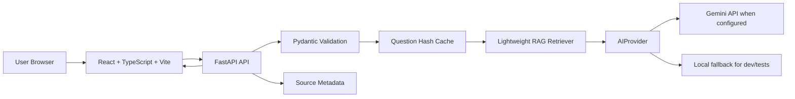

# Viksit Bharat 2047 AI

**Your Vision. India's Future.**

Viksit Bharat 2047 AI is an independent, non-government AI product for asking what India could look like in 2047, generating structured future scenarios, and creating shareable **My Viksit Bharat Vision** cards.

> This is an independent AI project inspired by the Viksit Bharat@2047 vision. It is not an official Government of India website or platform.

## Features

- Modern mobile-first React interface
- 11 language UI architecture: English, Hindi, Telugu, Tamil, Marathi, Bengali, Gujarati, Kannada, Malayalam, Punjabi, Odia
- FastAPI backend with Pydantic validation
- Gemini provider abstraction through `AIProvider`
- Local deterministic fallback when `GEMINI_API_KEY` is absent
- Lightweight RAG over verified-source metadata
- Structured AI response with sources and fact/scenario disclaimer
- Browser-native speech recognition and speech synthesis where supported
- Dynamic shareable vision card with PNG download, copy text and Web Share API
- Anonymous pulse dashboard empty state with no fake statistics
- In-memory cache and configurable server-side rate limiting
- SEO metadata, favicon and social preview

## Architecture



## Tech Stack

- Frontend: React, TypeScript, Vite, CSS, lucide-react, html-to-image
- Backend: Python, FastAPI, Pydantic, httpx
- AI: Gemini API via backend-only environment variable
- RAG: JSON knowledge base for MVP, designed to migrate to Supabase/PostgreSQL vector search
- Voice: Browser Web Speech APIs

## Project Structure

```text
backend/
  app/
    ai/
    api/
    core/
    data/
    rag/
    services/
    utils/
  tests/
frontend/
  public/
  src/
    components/
    hooks/
    locales/
    services/
    types/
    utils/
```

## Environment Variables

Copy `.env.example` to `.env` for local backend use.

```text
GEMINI_API_KEY=
GEMINI_MODEL=gemini-2.5-flash
RATE_LIMIT_PER_HOUR=10
CACHE_TTL_SECONDS=86400
FRONTEND_ORIGIN=http://localhost:5173
VITE_API_BASE_URL=http://localhost:8000
```

`GEMINI_API_KEY` must stay on the backend. Never put it in frontend code.

## Local Setup

Backend:

```bash
cd backend
python -m venv .venv
.venv\Scripts\activate
pip install -r requirements.txt
uvicorn app.main:app --reload --host 0.0.0.0 --port 8000
```

Frontend:

```bash
cd frontend
npm install
npm run dev
```

Open `http://localhost:5173`.

## Testing

Backend:

```bash
cd backend
python -m pytest
```

Frontend:

```bash
cd frontend
npm run lint
npm run build
```

Automated tests do not call Gemini. The local fallback is used when no API key is configured.

## RAG Architecture

MVP knowledge documents live in `backend/app/data/knowledge_documents.json` with:

```json
{
  "title": "",
  "source": "",
  "url": "",
  "category": "",
  "state": "",
  "content": "",
  "date": ""
}
```

The backend retrieves relevant documents by category, state and text overlap, then passes only retrieved context to the AI provider. Sources shown in the UI come from retrieved metadata only.

Source documents live in `RAG_Data/` (PDF reports and statistical CSV datasets). To (re)ingest them into the retriever knowledge base, run:

```bash
cd backend
pip install -r requirements.txt
python scripts/ingest_rag_data.py
```

This extracts text from the PDFs, summarizes the World Bank / Our World in Data CSVs, and regenerates `backend/app/data/knowledge_documents.json`. The `archive/` folder is intentionally skipped.

## Multilingual Architecture

UI translations are stored in `frontend/src/locales/*.json`. The selected language persists in `localStorage` and is sent to the backend so Gemini can generate the response in the selected language.

## Voice Architecture

The frontend uses browser-native `SpeechRecognition`/`webkitSpeechRecognition` and `speechSynthesis`. If a browser does not support speech recognition, the UI shows a typing fallback. No paid voice API is required for the MVP.

## Privacy And Security

- No name, email, phone or address is required
- Question hashes are used for cache keys
- Gemini API key is backend-only
- CORS is configured through environment variables
- Rate limiting is server-side and configurable
- Responses include a visible disclaimer separating facts from AI scenarios
- No official government logos or seals are used

## Social Sharing Previews

When a card link is shared on WhatsApp, Facebook, X or LinkedIn, those platforms fetch the public card page (`/c/{id}`) and use its Open Graph tags to render the vision-card image preview.

For the preview to appear:

1. Set `PUBLIC_BASE_URL` in `backend/.env` to the public origin of the deployed app (for example `https://your-domain.com`). This value is used to build the `share_url` and `og:image` URL. Without it, URLs fall back to the request host, which can be internal (or `localhost` in development) and unreachable by social crawlers.
2. Share a **public** card URL — previews cannot be generated for `localhost` URLs.
3. WhatsApp caches previews aggressively. After a fix, force a refresh by pasting the URL in the `wa.me` preview or use the WhatsApp "Debug" helper if available; Facebook has a Sharing Debugger for the same purpose.

The backend also serves the built frontend at `/c/{id}` (see `spa_fallback` in `backend/app/main.py`), so a single deployed origin is sufficient.

## Deployment

Free and low-cost provider limits can change. Verify current pricing before launch.

- Frontend: Vercel, Netlify or GitHub Pages for static hosting
- Backend: Render, Fly.io, Railway or another FastAPI-compatible low-cost host
- Database later: Supabase/PostgreSQL for `visions`, `analytics_events`, and `knowledge_documents`
- AI: Gemini API, configured through backend environment variables

For production, replace the in-memory cache and pulse store with PostgreSQL/Supabase tables. In-memory state resets when the backend restarts.

## Roadmap

1. MVP: landing page, AI question system, Gemini integration, English/Hindi path
2. Bharat languages: all requested Indian language UI files
3. RAG: richer verified knowledge base and vector search
4. Voice: better language support and speech controls
5. Viral layer: improved card templates and share URLs
6. Pulse: anonymous Supabase analytics
7. Production: monitoring, persistent cache, accessibility audit, deployment hardening

## License

MIT. Add a `LICENSE` file before public release if you want GitHub to display license metadata.

